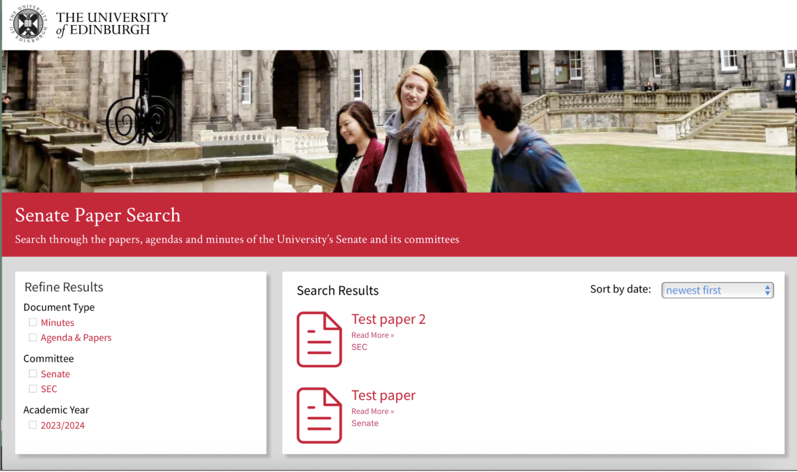

# Current Progress
## Web App Development
### Build Approach
I researched and evaluated possible build approaches for the web app, focusing on paper storage, keyword search, and automating hyperlinking. The recommended approach, and the one taken in development of the prototype, is to use a content management system. Using a content management system provides scalability/ability to handle large amounts of Senate Documents and has the added benefit of speeding up development due to the wide amount of community-developed modules freely available. The CMS currently being used for development is WordPress. For more information about build approach evaluations, please read the [Build Approach](../internship/build-approach.md) file.

### Prototype Website
The prototype website is being developed on a LocalWP dev environment. The custom taxonomy and custom post type have been configured to correctly take in the metadata and files for a paper. At the moment, the XML file must be uploaded seperately to the PDF document. In the future, we are hoping to make it so that the PDF can be uploaded and then automatically converted to XML/hyperlinked. 

Currently, the homepage has the ability to display all papers. Users can filter by document type, committee, and academic year. They can also sort papers by date (either newest first or oldest first). Below is a current screenshot of the protoyped homepage:

## Hyperlinking Pipeline
* Outline of pipeline/main goal
* Development of custom XML schema
* Python script for converting PDFs to custom schema. Generally works well on Minutes documents but struggles on longer Agenda & Papers documents where there is more atypical formatting, complicated table structure, variety of image type, etc.
* XML can be rendered as HTML using XSLT sheet
